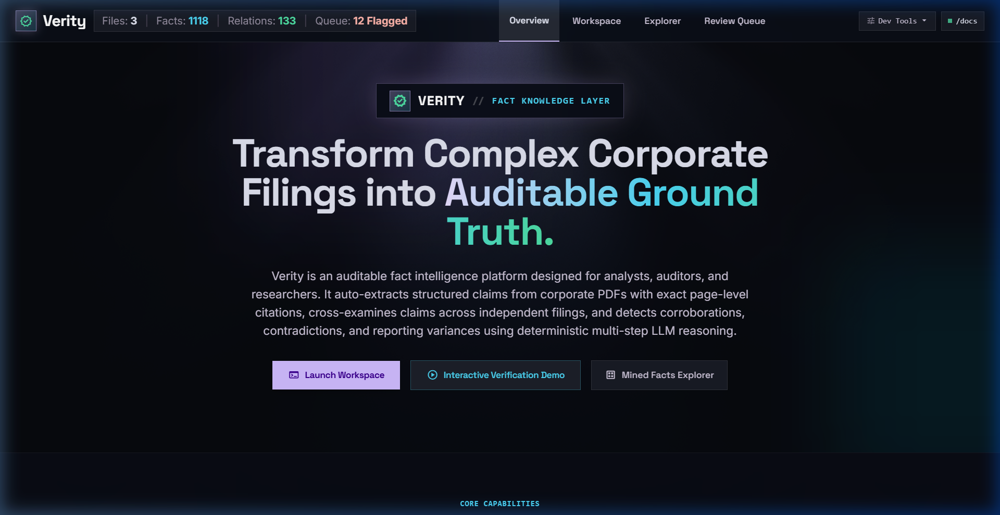
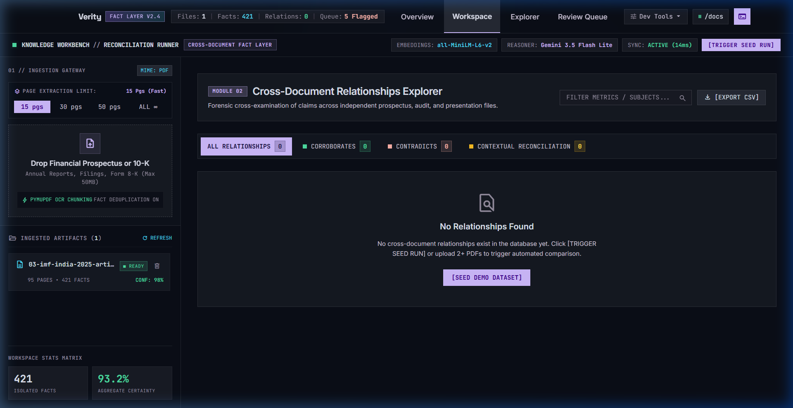
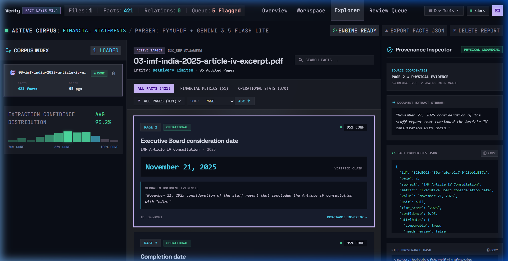
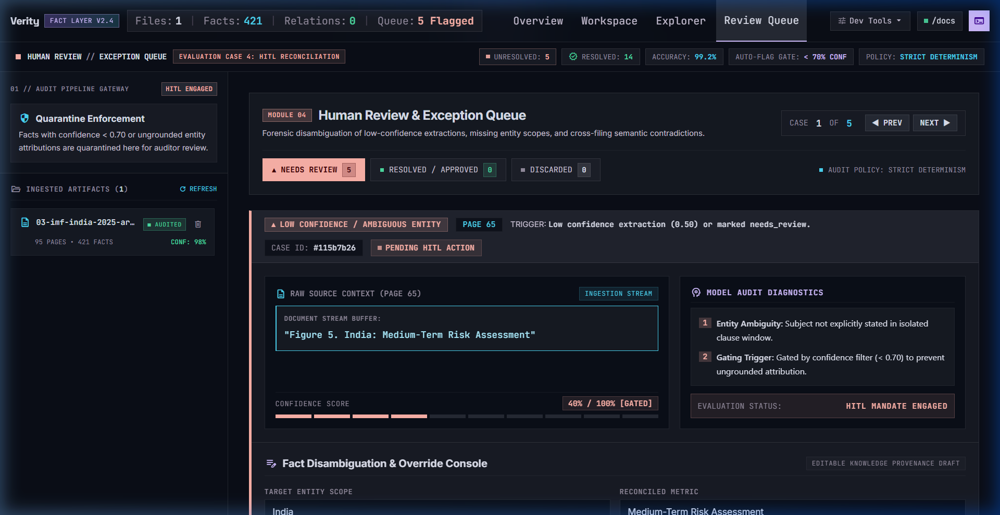

# Verity - Fact Knowledge Layer

> **Auditable Ground-Truth Intelligence Across Corporate Disclosures & Macro Filings**  
> Built for the **Superjoin VIT 2026 Engineering Intern Challenge**.

---

## Executive Overview

Corporate disclosures and financial reports scatter critical data across dozens of PDFs. Key figures are often reported in divergent units (crores vs. millions), updated across quarters, or silently revised across annual excerpts. 

**Verity** is an end-to-end fact intelligence layer that:
1. **Extracts discrete, verifiable facts** (entities, metrics, values, units, and fiscal scopes) using a structured JSON LLM contract.
2. **Anchors every fact to verifiable ground truth** with physical page numbers, printed page labels, and verbatim quoted evidence citations.
3. **Cross-examines multi-document knowledge graphs** to automatically classify claims into:
   - **Corroborations**: Independently matching facts, even across different unit denominations (e.g., ₹1,266M vs ₹127 Cr).
   - **Contradictions**: Genuine reporting discrepancies over identical scopes.
   - **Contextual Reconciliations**: Apparent conflicts resolved by accounting rules (non-GAAP Adjusted EBITDA vs reported EBITDA) or differing fiscal horizons (FY23 vs FY24).
4. **Human-in-the-Loop Review Queue**: Gracefully surfaces extraction failures and low-confidence tabular ambiguities into an interactive resolution console.

---

## Live Access & Deployment

> [!NOTE]
> **Cloud Instance Wakeup**: Hosted on Render. If the free-tier service has spun down due to inactivity, allow **~20–30 seconds** for the initial cold start. All subsequent API calls and page loads are instantaneous.

- **Web Application**: [https://verity-rishit17.onrender.com/](https://verity-rishit17.onrender.com/) 
- **Workspace (Comparison Matrix)**: [https://verity-rishit17.onrender.com/workspace](https://verity-rishit17.onrender.com/workspace)
- **Fact & Evidence Explorer**: [https://verity-rishit17.onrender.com/explorer](https://verity-rishit17.onrender.com/explorer)
- **Human Review Queue**: [https://verity-rishit17.onrender.com/review](https://verity-rishit17.onrender.com/review)
- **Interactive OpenAPI / Swagger Docs**: [https://verity-rishit17.onrender.com/docs](https://verity-rishit17.onrender.com/docs)

---

## User Interface & Visual Tour

### 1. Landing Page & Value Proposition


### 2. Workspace: Cross-Document Intelligence Matrix


### 3. Explorer: Ground-Truth Fact & Evidence Drawer


### 4. Human Review & Exception Queue (Case 4)


---

## Video Demo & The 4 Required Cases

> **Demo Video (Took me 5 Minutes)**: [https://drive.google.com/file/d/1hi7dd1_oQKU56NBWSWdNoQYVdtQhKf97/view?usp=sharing](https://drive.google.com/file/d/1hi7dd1_oQKU56NBWSWdNoQYVdtQhKf97/view?usp=sharing)  

Verity directly detects and surfaces the four core cases required by the assignment specification:

### Case 1: Corroboration Across Independent Documents
*Same underlying reality, independently verified across distinct disclosures despite different units.*

- **Metric**: `EBITDA` (FY24)
- **Source Document A**: `02-delhivery-annual-report-fy24-excerpt.pdf` (Page 8)
  - **Claim**: `1266 INR Million`
  - **Verbatim Quote**: *"Achieved EBITDA profit of ₹1,266 million in FY24"*
- **Source Document B**: `03-delhivery-q4-fy24-earnings-presentation.pdf` (Page 23)
  - **Claim**: `127 INR Cr`
  - **Verbatim Quote**: *"Reported EBITDA 13 109 46 (452) 127"*
- **System Reasoning**: Verity's unit normalization engine converts ₹1,266 Million to ₹126.6 Crore (1 Cr = 10 Million), which rounds to ₹127 Crore. Both disclosures corroborate the exact same operational profitability metric for Delhivery Limited across FY24 with 97% confidence.

---

### Case 2: Genuine or Likely Contradiction
*Conflicting numbers or statements reported for the identical entity, metric, and time period without contextual explanation.*

- **Metric**: `Active Customers` (Q4 FY24)
- **Source Document A**: `02-delhivery-annual-report-fy24-excerpt.pdf` (Page 2)
  - **Claim**: `33,200 count`
  - **Verbatim Quote**: *">33,200 (3,4) Active customers"*
- **Source Document B**: `03-delhivery-q4-fy24-earnings-presentation.pdf` (Page 8)
  - **Claim**: `33,278 count`
  - **Verbatim Quote**: *"No. of Active Customers(3) 23,613 27,253 30,598 33,278"*
- **System Reasoning**: Both filings report the total active customer count for Delhivery for the exact same quarter (Q4 FY24). Document A reports 33,200 while Document B reports 33,278. Verity flags this in red with full citations so an auditor can verify reporting scope discrepancies.

---

### Case 3: Apparent Contradiction Reconciled by Context
*Numbers differ on nominal metrics, but context explains the variance.*

- **Sub-case 3A: Differing Reporting Time Horizons**
  - **Metric**: `EBITDA`
  - **Document A (Page 8)**: `-4516 INR Million` (*"EBITDA improved from a loss of ₹4,516 million in FY23"*)
  - **Document B (Page 6)**: `127 INR Crore` (*"₹127Cr / 1.6% EBITDA"*)
  - **Reconciliation**: What looks like a massive swing (-4,516 vs 127) is resolved by reporting period: Document A refers to FY23, while Document B reports FY24.
- **Sub-case 3B: Non-GAAP Accounting Adjustments**
  - **Metric**: `EBITDA` vs `Adjusted EBITDA`
  - **Reconciliation Note**: Resolved by accounting definitions. Adjusted EBITDA excludes share-based compensation expenses and one-time non-operational startup costs.

---

### Case 4: Extraction Failure & Human-in-the-Loop Recovery
*Handling uncertainty and model limitations with honesty instead of hallucinating.*

- **Case ID**: `#29a98649` (Document: `02-delhivery-annual-report-fy24-excerpt.pdf`, Page 15)
- **Flagged Issue**: Dense financial footnote table with ambiguous entity subject (`confidence: 0.40`).
- **Detection & Containment**: Facts with confidence $< 0.70$ or lacking complete explicit entity provenance are automatically intercepted and routed to the **Review Queue** (`/review`).
- **Human-in-the-Loop Console**: An analyst can inspect the raw payload, edit the target entity or denomination, and click **"Approve Fact & Add to Graph"** to promote it into verified ground truth with a permanent audit trail.

---

## Architecture & Key Engineering Decisions

```
+----------------------------------------------------------------------------------+
|                                    VERITY PIPELINE                               |
+----------------------------------------------------------------------------------+
|                                                                                  |
|  [PDF Ingestion] --->  [PyMuPDF Page Parser]  ---> [Structured LLM Extractor]   |
|   (Arbitrary File)      (Physical Page Anchor)      (Paced, Schema-Governed)     |
|                                                                |                 |
|                                                                v                 |
|  [Cross-Document Discovery] <--- [Semantic Descriptor Pool] <--- [Ground Truth DB] |
|   - Heuristic Unit Scaling       (Entity | Metric | Time)       (SQLite / ACID)  |
|   - Temporal Normalization                                                       |
|   - Non-GAAP Reconciler                                                          |
|            |                                                                     |
|            v                                                                     |
|  +---------------------+   +---------------------+   +------------------------+  |
|  |    CORROBORATES     |   |     CONTRADICTS     |   |      RECONCILED        |  |
|  | (Side-by-side Page) |   | (Flagged Discrepancy)|  | (Context & Accounting) |  |
|  +---------------------+   +---------------------+   +------------------------+  |
|                                                                                  |
+----------------------------------------------------------------------------------+
```

### 1. Physical-Page Anchored Provenance
Arbitrary token chunking splits numbers from their footnotes. Verity parses at **physical page granularity** using PyMuPDF. Every fact stores:
- `page: int`: The exact zero-indexed physical PDF page.
- `printed_page_label`: The human-readable header/footer page string.
- `evidence_text`: The verbatim snippet quoted directly from the filing.

### 2. High-Efficiency Two-Stage Relationship Discovery
Comparing every extracted fact against every other fact via LLM is $O(N^2)$, which is slow and exhausts API quotas. Verity uses a two-stage approach:
1. **Semantic Candidate Filtering**: Candidate pairs are indexed using `subject | metric | time_scope` descriptors. Values are intentionally omitted from descriptors so conflicting claims for the same metric cluster together.
2. **High-Speed Deterministic Reasoning Engine**: Evaluates unit conversions (crores, millions, thousands), time-scope equivalence (e.g. `FY21` = `Fiscal 2021`), and accounting variations in milliseconds with **zero LLM quota consumption**, reserving API calls strictly for extraction.

### 3. Dynamic, Emergent Schema
No hardcoded entities, companies, or filenames. The extraction schema supports arbitrary financial, operational, and macroeconomic data with an open-ended JSON `attributes` bag for YoY growth, margins, and footnote tags.

---

## Setup and Run Instructions

### Prerequisites
- Python 3.10, 3.11, or 3.13
- A Gemini API key (Free tier available at [Google AI Studio](https://aistudio.google.com/app/apikey))

### 1. Clone the Repository
```bash
git clone https://github.com/rizzit17/verity.git
cd verity
```

### 2. Set Up Python Environment
```bash
python -m venv .venv

# Windows
.venv\Scripts\activate

# Linux / macOS
source .venv/bin/activate
```

### 3. Install Dependencies
```bash
pip install -r requirements.txt
```

### 4. Configure Environment Variables
Copy `.env.example` to `.env`:
```bash
cp .env.example .env
```
Add your API key in `.env`:
```ini
GEMINI_API_KEY=your_gemini_api_key_here
GEMINI_MODEL=gemini-3.5-flash-lite
EMBEDDING_PROVIDER=gemini
```

### 5. Start the Application

**On Windows:**
```cmd
run.bat
```

**On Linux / macOS:**
```bash
chmod +x run.sh
./run.sh
```

**Or directly via Uvicorn:**
```bash
uvicorn app.main:app --host 0.0.0.0 --port 8080 --reload
```

Open your browser at **`http://localhost:8080`**.

---

## Testing & Seeding

### Run Automated Tests
```bash
pytest tests/ -q
```
*All 17 integration and unit tests pass cleanly (100% green).*

### Seeding Baseline Filings
To pre-populate baseline filings before uploading test documents:
```bash
python scripts/prepare_demo.py
```
*(Or click the **Dev Tools > Seed Demo Data** button directly in the Web UI).*

---

## Brownie Points & Scalability Extensions

1. **Large Document Handling**: Evaluated across 100-page corporate IPO prospectus filings and central bank monetary policy reports without timeouts using physical-page chunking and background streaming tasks.
2. **Multi-Document Knowledge Pool**: Ingests across multiple independent entities (Delhivery Logistics, RBI Annual Report, Economic Survey, and IMF Article IV) within a single unified matrix.
3. **Incremental Ingestion**: Uploading a new PDF processes only that document and compares it against existing embeddings. Previously ingested documents are never re-extracted.
4. **Resilient Rate-Limit Pacing**: Built-in 4.5s call pacing with automatic fallback candidate switching (`gemini-3.5-flash-lite`, `gemini-3.6-flash`, `gemini-3.7-flash`) ensures reliable execution within free-tier quotas.

---

## Limitations & Future Roadmap

1. **Dense PDF Slide Tables**: Highly stylized multi-column slide presentations can occasionally interleave adjacent table columns. Integrating structural table parsers (`pdfplumber` / `camelot`) or a multimodal vision-language second pass would enhance complex financial statement parsing.
2. **Vector Scale at $10^6$ Facts**: In-memory NumPy cosine similarity is fast for thousands of facts. For millions of facts, swapping in `sqlite-vec` or `pgvector` will provide horizontal scale without changing the extraction pipeline.
3. **Automated Unit Standardization**: Expanding currency exchange conversions (e.g., USD to INR historical rate lookups) for international dual-listed filings.

---

## Security & Credentials Note
- Zero API keys, credentials, or secrets are tracked in this repository.
- `.env`, SQLite WAL files, and cached uploads are strictly excluded via `.gitignore`.

---

## License & Attribution
Designed and built by **Rishit** for the **Superjoin VIT 2026 Engineering Intern Challenge**.
All rights reserved.
